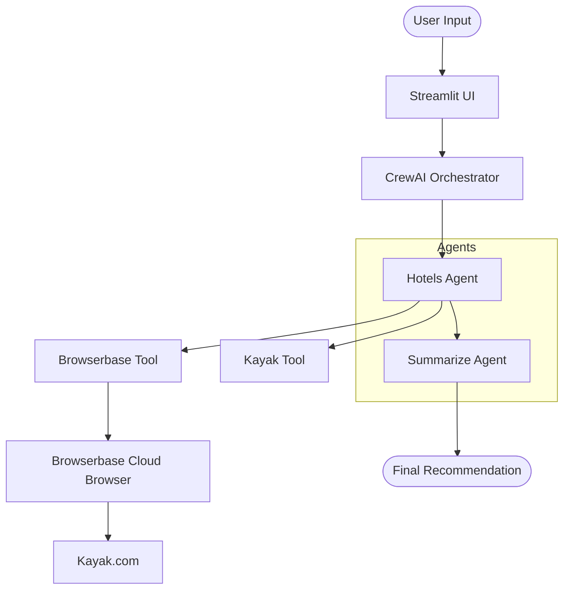

# 🏨 HotelFinder Pro: Intelligent Multi-Agent Hotel Search

<div align="center">

**Automate your travel research with an AI-powered agentic system.**


[Features](#-key-features) • [Architecture](#-how-it-works) • [Installation](#-installation--setup) • [Usage](#-running-the-app) • [Troubleshooting](#-common-issues--troubleshooting)

</div>

---

## 🎯 Project Overview

**HotelFinder Pro** is a cutting-edge multi-agent AI system designed to solve the "tabs overload" problem when searching for hotels. By orchestrating specialized AI agents, the system automates real-time web scraping, pricing analysis, and provider comparison to deliver the best travel deals in minutes.

### Why HotelFinder Pro?
- **Saves Time**: Replaces hours of manual searching with a single automated workflow.
- **Agentic Intelligence**: Uses **CrewAI** to manage agents that "think" and "reason" through search results.
- **Reliable Scraping**: Leverages **Browserbase** to handle JavaScript-heavy sites and bypass bot detection.
- **Privacy & Flexibility**: Supports 100% local execution using **DeepSeek-R1** via Ollama or high-speed cloud providers like **Groq** and **OpenAI**.

---

## ✨ Key Features

- 🔍 **Real-Time Search**: Live scraping from sites like Kayak.com.
- 💰 **Price Comparison**: Automatically compares rates across multiple booking platforms.
- 🤖 **Multi-Agent Workflow**: Specialized agents for searching, analyzing, and summarizing.
- 📊 **Structured Results**: Returns top 5 recommendations with ratings, amenities, and direct booking links.
- 🌐 **Clean Web UI**: Built with Streamlit for an intuitive user experience.

---

## 🏗️ How It Works

### System Architecture
The system follows a sequential multi-agent collaboration pattern:



1.  **Hotels Agent**: Generates search URLs and executes headless browser sessions to extract raw hotel data.
2.  **Summarize Agent**: Processes the raw data, identifies the best value-for-money options, and formats the output.

---

## 📦 Installation & Setup

### Prerequisites
- **Python 3.12+**
- **Git**
- **Browserbase Account** ([Sign up here](https://browserbase.ai))

### 1. Clone the Repository
```bash
git clone https://github.com/itsA-D/NomadIQ.git
cd hotel-booking-crew
```

### 2. Environment Setup (Choose One)

#### **Option A: Conda (Recommended for Windows Users)**
```powershell
conda create -n hotelbai python=3.12 -y
conda activate hotelbai
pip install -r requirements.txt
playwright install chromium
```

#### **Option B: uv (Fastest)**
```bash
pip install uv
uv sync
playwright install chromium
```

#### **Option C: Virtualenv (Standard)**
```bash
python -m venv .venv
# Windows:
.venv\Scripts\activate
# Linux/macOS:
source .venv/bin/activate
pip install -r requirements.txt
playwright install chromium
```

---

## ⚙️ Configuration

Create a `.env` file in the project root by copying the template:
```bash
cp .env.example .env
```

Add your API keys to `.env`:

| Key                      | Description                    | Source                                          |
| :----------------------- | :----------------------------- | :---------------------------------------------- |
| `BROWSERBASE_API_KEY`    | Required for web scraping      | [Browserbase Dashboard](https://browserbase.ai) |
| `BROWSERBASE_PROJECT_ID` | Required for browser sessions  | [Browserbase Settings](https://browserbase.ai)  |
| `GROQ_API_KEY`           | Recommended for fast, free LLM | [Groq Console](https://console.groq.com)        |
| `OPENAI_API_KEY`         | Required for OpenAI model      | [OpenAI Platform](https://platform.openai.com)  |

---

## 🚀 Running the App

### **Step 1: Start the Dashboard**
```bash
streamlit run app.py
```

### **Step 2: Choose Your Engine**
- **Groq (Default)**: Lightning-fast inference (Llama-3).
- **DeepSeek-R1 (Local)**: Ensure Ollama is running (`ollama serve`) and pull the model: `ollama pull deepseek-r1`.
- **OpenAI**: Run specialized version using `streamlit run app_openai.py`.

### **Step 3: Search**
1. Enter a **Location** (e.g., "Paris", "New York").
2. Select **Check-in/Check-out** dates.
3. Click **Search Hotels** and wait 1-3 minutes for the agents to finish their research.

---

## 🛠️ Common Issues & Troubleshooting

### **1. Module Not Found (LiteLLM)**
If you encounter import errors for LiteLLM:
```bash
pip install litellm
```

### **2. Playwright Errors**
If the browser fails to launch:
```bash
playwright install chromium
```

### **3. Quota Exceeded (OpenAI)**
OpenAI free tiers are strictly limited. If you see code `429`, switch to **Groq** which offers a generous free tier for developers.

### **4. Execution Policy (Windows)**
If you cannot activate the virtual environment in PowerShell:
```powershell
Set-ExecutionPolicy -ExecutionPolicy RemoteSigned -Scope CurrentUser
```

### **5. API Key Not Detected**
Ensure your `.env` file is in the root directory and contains no extra spaces around the equals sign.

---

## 📂 Project Structure

- `app.py`: Main Streamlit app (supports Groq & Local LLMs).
- `app_openai.py`: OpenAI-specific variant.
- `browserbase.py`: Custom tool for cloud-based headless scraping.
- `kayak.py`: Tool for dynamic URL construction.
- `assets/`: UI assets and logos.
- `setup-windows.ps1`: Automated repair script for Windows environments.

---

## 🤝 Contributing & Support

Contributions are welcome! If you find a bug or have a feature request, please open an issue.

**Happy Travels! 🛫🏨**
