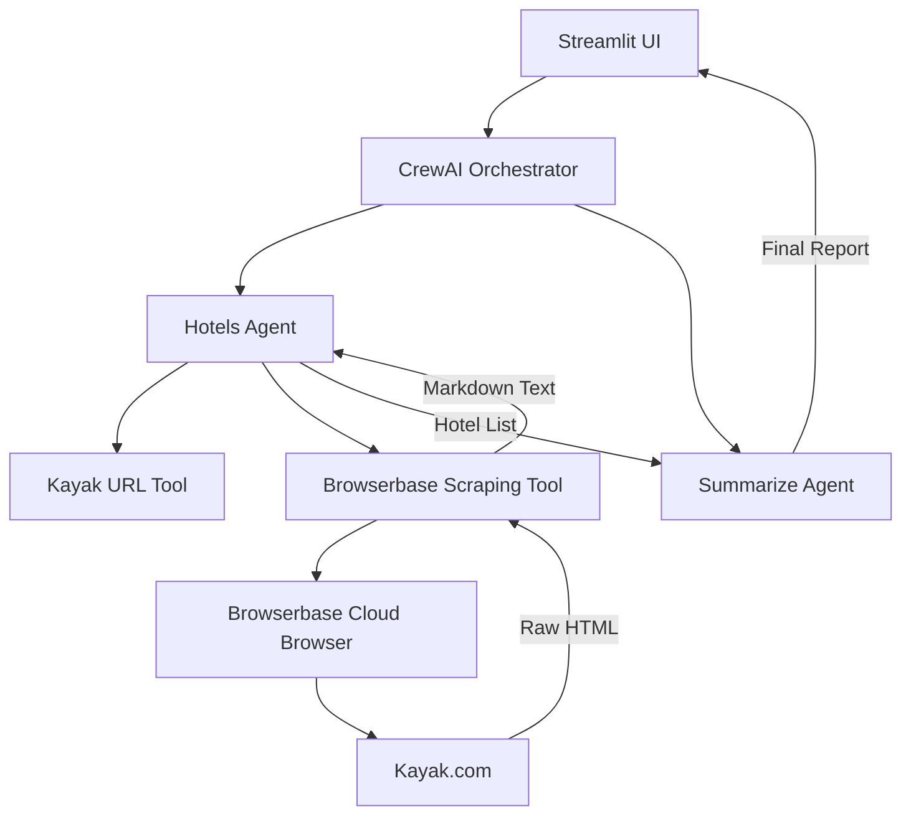

# 🏨 HotelFinder Pro: Intelligent Multi-Agent Travel Assistant

<div align="center">

**Mastering Travel Research through Agentic AI and Headless Automation.**


---

### "Stop browsing, start discovering. Let AI agents do the research for you."

</div>

## 📑 Table of Contents

- [🏨 HotelFinder Pro: Intelligent Multi-Agent Travel Assistant](#-hotelfinder-pro-intelligent-multi-agent-travel-assistant)
    - ["Stop browsing, start discovering. Let AI agents do the research for you."](#stop-browsing-start-discovering-let-ai-agents-do-the-research-for-you)
  - [📑 Table of Contents](#-table-of-contents)
  - [🎯 Project Overview](#-project-overview)
    - [✨ Key Features](#-key-features)
  - [� Problem Statement \& Motivation](#-problem-statement--motivation)
    - [The Problem](#the-problem)
    - [The Solution](#the-solution)
  - [� Quick Start](#-quick-start)
  - [📦 Detailed Installation \& Setup](#-detailed-installation--setup)
    - [Option A: Using Conda (Recommended for Windows)](#option-a-using-conda-recommended-for-windows)
    - [Option B: Using uv (Fastest)](#option-b-using-uv-fastest)
    - [Option C: Using Python venv](#option-c-using-python-venv)
  - [🏗️ System Architecture](#️-system-architecture)
  - [⚙️ Configuration Guide](#️-configuration-guide)
    - [1. Environment Variables](#1-environment-variables)
    - [2. LLM Engine Options](#2-llm-engine-options)
  - [� Multi-Agent Workflow](#-multi-agent-workflow)
    - [🤵 Agent 1: The Hotels Specialist](#-agent-1-the-hotels-specialist)
    - [🤵 Agent 2: The Travel Summarizer](#-agent-2-the-travel-summarizer)
  - [🛠️ Implementation Details](#️-implementation-details)
    - [Browserbase Tool (`browserbase.py`)](#browserbase-tool-browserbasepy)
    - [Kayak Search Tool (`kayak.py`)](#kayak-search-tool-kayakpy)
  - [� Troubleshooting](#-troubleshooting)
    - [1. Connection Error / Browserbase](#1-connection-error--browserbase)
    - [2. LLM Serialization Error](#2-llm-serialization-error)
    - [3. LiteLLM Missing](#3-litellm-missing)
    - [4. Windows Execution Policy](#4-windows-execution-policy)
  - [📈 Professional Repair Log Summary](#-professional-repair-log-summary)

---

## 🎯 Project Overview

**HotelFinder Pro** is a state-of-the-art multi-agent AI system designed to automate the complex process of hotel search and pricing comparison. By orchestrating specialized agents powered by **CrewAI**, the system navigates real-time travel data via **Browserbase** headless browsers, evaluates offers, and synthesizes the best results into a clean, actionable report.

### ✨ Key Features
- **Intelligent Reasoning**: Agents don't just search; they evaluate amenities, ratings, and value-for-money.
- **Robust Scraping**: Powered by Browserbase to handle dynamic JavaScript content on Kayak.com.
- **Provider Comparison**: Gathers rates from multiple booking platforms automatically.
- **Flexible LLM Backend**: Supports local execution (**DeepSeek-R1 via Ollama**) or cloud speed (**Groq**, **OpenAI**).
- **Proactive Error Handling**: Built-in validation and graceful fallback mechanisms.

---

## � Problem Statement & Motivation

### The Problem
Traditional travel research is **fragmented and time-consuming**. A user typically opens 5-10 tabs, manually tracks prices across Kayak, Booking.com, and Hotels.com, and struggles to compare amenities side-by-side while dealing with dynamic pricing fluctuations.

### The Solution
HotelFinder Pro centralizes this entire workflow. It uses **Agentic AI** to simulate the behavior of a human researcher—navigating sites, extracting data, and comparing results—but at a scale and speed impossible for humans.

---

## � Quick Start

If you already have your API keys ready, follow these three steps to be up and running in 2 minutes:

```powershell
# 1. Clone & Enter
git clone https://github.com/itsA-D/NomadIQ.git
cd hotel-booking-crew

# 2. Setup Environment (Windows/Conda)
conda create -n hotelbai python=3.12 -y
conda activate hotelbai
pip install -r requirements.txt
playwright install chromium

# 3. Run
streamlit run app.py
```

---

## 📦 Detailed Installation & Setup

### Option A: Using Conda (Recommended for Windows)
Perfect for users who want isolated, reproducible environments.
```powershell
conda create -n hotel-booking-crew python=3.12 -y
conda activate hotel-booking-crew
pip install -r requirements.txt
playwright install chromium
```

### Option B: Using uv (Fastest)
The modern choice for dependency resolution (10-100x faster than pip).
```powershell
pip install uv
uv sync
playwright install chromium
```

### Option C: Using Python venv
No external tools required.
```bash
python -m venv .venv
# On Windows: .venv\Scripts\activate
# On macOS/Linux: source .venv/bin/activate
pip install -r requirements.txt
playwright install chromium
```

---

## 🏗️ System Architecture

HotelFinder Pro uses a **Sequential Hierarchical** architecture where tasks are delegated across specialized layers.



---

## ⚙️ Configuration Guide

### 1. Environment Variables
Create a `.env` file in the project root:
```env
# REQUIRED: Get these from https://browserbase.ai
BROWSERBASE_API_KEY=your_key_here
BROWSERBASE_PROJECT_ID=your_id_here

# CLOUD LLM (Pick One)
GROQ_API_KEY=your_groq_key_here  # Recommended: Free & Fast
OPENAI_API_KEY=your_openai_key_here # Standard but Paid
```

### 2. LLM Engine Options
- **Groq (Default in `app.py`)**: Uses `llama-3.3-70b-versatile`. Extremely fast.
- **Ollama (Local)**: Pull the model: `ollama pull deepseek-r1`.
- **OpenAI**: Requires `app_openai.py`.

---

## � Multi-Agent Workflow

### 🤵 Agent 1: The Hotels Specialist
- **Role**: Search and data extraction expert.
- **Capabilities**: Expert at constructing specific search queries and identifying data patterns in raw HTML.
- **Tools**: `kayak_hotels` (URL generation), `browserbase` (Scraping).

### 🤵 Agent 2: The Travel Summarizer
- **Role**: Data analyst and presentation expert.
- **Capabilities**: Compares pricing across providers and highlights the "Best Value" for the user.
- **Output**: Generates the final 5-hotel recommendation list.

---

## 🛠️ Implementation Details

### Browserbase Tool (`browserbase.py`)
Unlike standard scrapers, this tool connects to a **remote headless browser session**.
1. Establishes a WebSocket connection to the cloud.
2. Waits **25 seconds** for JavaScript/React components on Kayak to fully render.
3. Converts the complex DOM into clean, readable Markdown for the AI to process.

### Kayak Search Tool (`kayak.py`)
A specialized utility that formats user dates and locations into search-friendly URL strings like:
`https://www.kayak.co.in/hotels/{location}/{check_in}/{check_out}/2adults`

---

## � Troubleshooting

### 1. Connection Error / Browserbase
- **Symptom**: "Tool Browserbase tool failed".
- **Fix**: Check your `BROWSERBASE_API_KEY`. Ensure you have active credits on the dashboard.

### 2. LLM Serialization Error
- **Symptom**: `UnserializableReturnValueError`.
- **Fix**: This was locally patched by changing `@st.cache_data` to `@st.cache_resource` in `app.py`.

### 3. LiteLLM Missing
- **Symptom**: `ImportError: Fallback to LiteLLM is not available`.
- **Fix**: Run `pip install litellm` within your active environment.

### 4. Windows Execution Policy
- **Symptom**: Cannot activate scripts in PowerShell.
- **Fix**: Run `Set-ExecutionPolicy -ExecutionPolicy RemoteSigned -Scope CurrentUser`.

---

## 📈 Professional Repair Log Summary

The current codebase includes these critical stability patches:
- ✅ **Logo Recovery**: Restored missing `assets/` folder to prevent UI crashes.
- ✅ **Memory Optimization**: Implemented `cache_resource` for LLM objects to avoid memory leaks and serialization bugs.
- ✅ **Quota Resilience**: Added fallbacks to Groq and Ollama to handle OpenAI 429 errors.
- ✅ **Validation Layer**: Built-in date and location sanity checks.

---

**Built with ❤️ by [itsA-D](https://github.com/itsA-D)**  
*Project Status: Production-Ready ✅*
